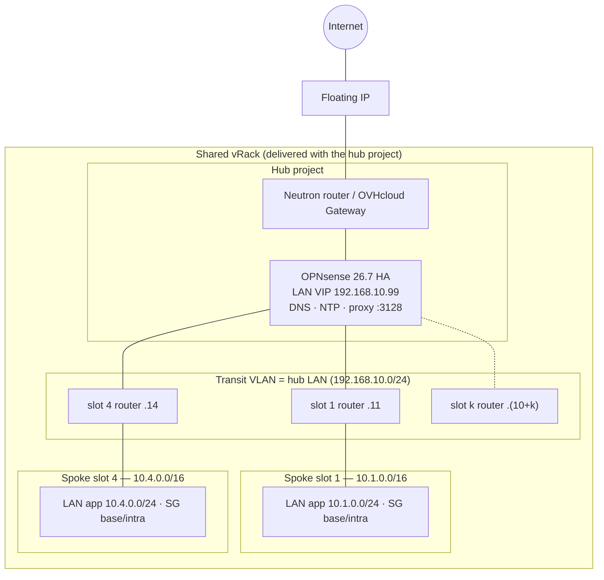

# Architecture — Mono-vRack + LAN transit (zero-trust)

## Overview

A **single vRack** connects every bubble. Only the hub runs a firewall: an **OPNsense 26.7 active/passive pair** (CARP, pfsync, xmlrpc) that also hosts the shared services on its LAN CARP VIP — **unbound DNS, ntpd and an explicit squid proxy**. Spokes are Public Cloud projects without any appliance: a Neutron router, one or more LANs, and **security groups curated by the platform team**.

## Slots: one number instead of a registry

Every spoke is a **slot** *k* (1..`slot_count`, 20 by default). **Slots 2 and 3 are reserved**: `10.2.0.0/16` and `10.3.0.0/16` are the default pod and service ranges of OVHcloud Managed Kubernetes, and a spoke there collides with any cluster left on defaults (see [06](06-managed-services.md)); the hub still carries their routes, they simply stay unused. Everything derives from the slot:

| | Formula | Slot 1 | Slot 4 |
|---|---|---|---|
| supernet | `cidrsubnet(10.0.0.0/8, 8, k)` | `10.1.0.0/16` | `10.4.0.0/16` |
| LAN *n* | `cidrsubnet(supernet, 8, n)` | `10.1.n.0/24` | `10.4.n.0/24` |
| VLAN *n* | `1000 + 10k + n` | 1010–1019 | 1040–1049 |
| transit IP | `cidrhost(hub LAN, 10 + k)` | `192.168.10.11` | `192.168.10.14` |

The hub XML contains, **from Day‑1**, one OPNsense gateway and one static route per slot (plain configuration objects — no OVH resource, no cost). Adding a spoke therefore needs **no call to the hub**: the route to its supernet already exists. Routes to empty slots point to an address nobody owns and are inert.

### Address ranges OVHcloud reserves (checked 2026-08-28)

| Range | Reserved by | Consequence for the plan |
|---|---|---|
| `10.2.0.0/16` | MKS Free — pod network (Canal) | **slot 2 reserved** |
| `10.3.0.0/16` | MKS Free and Standard — Service network (`kubernetes` ClusterIP = `10.3.0.1`) | **slot 3 reserved** |
| `10.240.0.0/13` | MKS Standard — pod network (Cilium); customisable at creation (Standard only) | outside the plan: slots stop at 200 |
| `172.17.0.0/16` | Docker daemon on MKS nodes ("known not compliant") | never for hub WAN/LAN/HASYNC (module precondition) |
| `172.31.0.0/17` | Ext‑Net — gateway ports of compute nodes handling Floating IPs; "avoid for private subnets when Floating IPs are in use" | never for hub WAN/LAN/HASYNC (module precondition); the hub *uses* a Floating IP |
| `169.254.0.0/16` | link‑local: metadata `169.254.169.254`, DHCP ports | implicit, never assign |
| first / last address of a subnet (+ gateway) | Neutron and vRack Services reserve them; DHCP takes 2 IPs, a Gateway 1+1, an Octavia LB 3 | LAN pools are `.10`–`.200`, `/24` minimum |

No OVHcloud constraint touches `192.168.0.0/16` or the rest of `172.16.0.0/12`; the hub defaults (`172.16.0.0/24` WAN,
`172.16.254.0/30` HASYNC, `192.168.10.0/24` LAN) are clear of every line above. Custom cluster CIDRs
(`ipAllocationPolicy`) exist for the Standard plan only, so reserving slots 2 and 3 is the one rule that covers
both plans. Sources: MKS *Known limits* and *Understanding MKS architecture*, Network Services *Known limits*,
vRack Services guide (docs.ovhcloud.com).

## Traffic flows

| Flow | Path | Decided by |
|---|---|---|
| workload → Internet | instance → spoke router → transit → hub VIP **:3128** → squid → WAN → Gateway | SG egress (`base`: proxy only) then hub |
| workload → DNS / NTP | same path to the VIP, ports 53 / 123 | SG `base` + hub rule |
| workload → workload, same spoke | LAN, no hub | SG `intra` |
| workload → workload, other spoke | router → hub → other router | SG egress (A) + **hub rule** + SG ingress (B) |
| workload → Internet, direct | — | dropped at the port (no public destination in any SG); dropped and logged at the hub if a permissive SG exists |
| admin → hub | Floating IP → WAN VIP :8443/:22 | `AdminClients` alias |

Two policy layers, two jobs: **security groups** at the instance port say *who may talk to whom* (zero-trust, admin-curated, delivered by code); the **hub firewall** inspects and logs whatever crosses the transit — inter-spoke, Internet, hub services — and is the single place where flows between bubbles are allowed.

## The zero-trust security groups

Created by `modules/network/spoke-slot` with the implicit egress-any rules removed (`delete_default_rules`), and the project's `default` group emptied:

| Group | Egress | Ingress |
|---|---|---|
| `<spoke>-base` | metadata `169.254.169.254:80`; hub VIP `53/udp+tcp`, `123/udp`, `3128/tcp`, ICMP; optional `extra_egress` whitelist | none (add per flow) |
| `<spoke>-intra` | members of the group | members of the group |
| `default` | *empty* | *empty* |

A compute-only identity (`compute_operator`) can boot instances — even with `Ext-Net` attached — and choose among these groups, but cannot create groups, floating IPs, routes, or disable port security: measured in the sandbox (see [05 — Guarantees](05-guarantees.md)).

## Design choices and native services

| Need | How this design answers it today | Native service on the roadmap |
|---|---|---|
| segment projects and route between them | slots + static routes pre-provisioned on the hub | [#1061 VPC](https://github.com/ovh/public-cloud-roadmap/issues/1061), [#1202 Subnet ACL](https://github.com/ovh/public-cloud-roadmap/issues/1202) |
| private inter-project connectivity | transit VLAN through the vRack (multi-region) | [#1200 VPC peering](https://github.com/ovh/public-cloud-roadmap/issues/1200) |
| keep workloads off the public network | security groups with no public destination + read-only audit | [#1136 IAM on public exposure](https://github.com/ovh/public-cloud-roadmap/issues/1136) |
| inspection, egress control, site-to-site VPN | OPNsense HA at the hub | — |

The spoke network module is the part a VPC will replace when it ships; the hub (inspection, egress, proxy, VPN) is the part that stays.

## Operator constraints

- **One slot per spoke**, never reused while the spoke exists, never 2 or 3. Keep the list of used slots (the `slot` variable of each spoke directory).
- **Hub networks outside `10.0.0.0/8`** (defaults: WAN `172.16.0.0/24`, HASYNC `172.16.254.0/30`, LAN/transit `192.168.10.0/24`).
- **Every spoke uses the hub LAN VLAN and CIDR as transit** — do not change them per spoke.
- **Hub sizing**: every inter-spoke and Internet flow goes through the OPNsense pair and, for the Internet, through squid.
