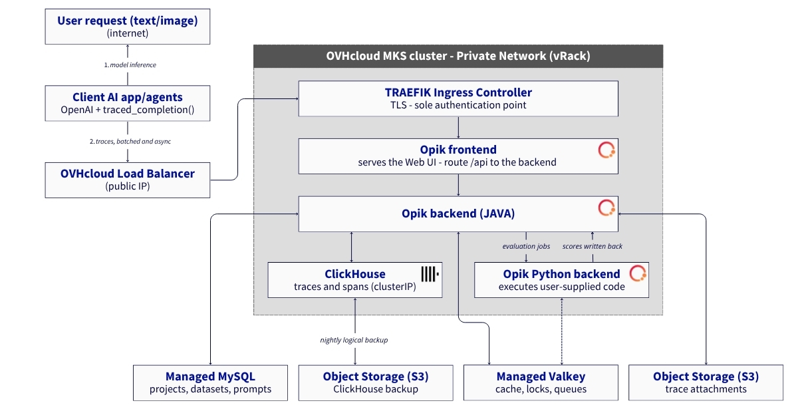
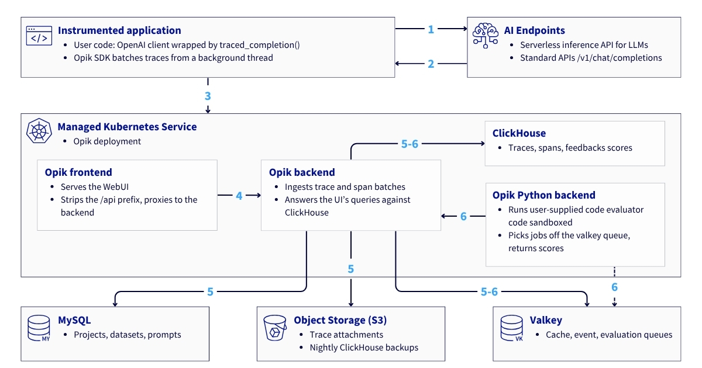
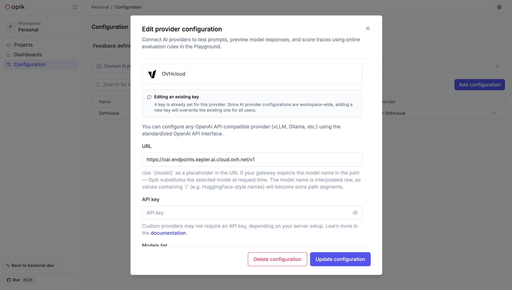
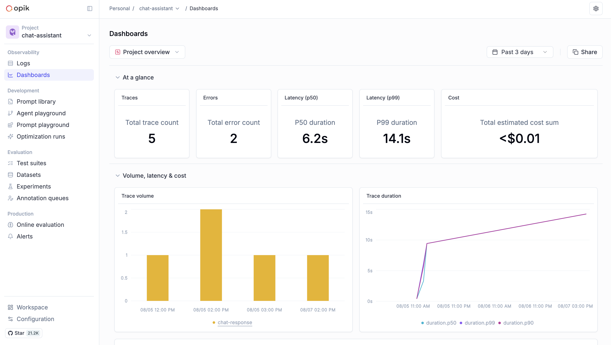
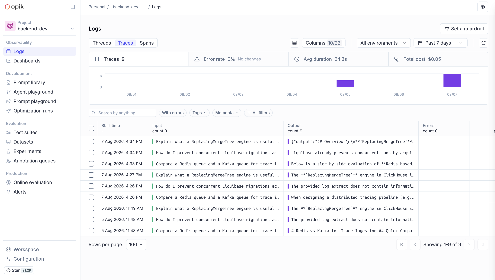

# Reference Architecture: Deploy Opik on OVHcloud MKS for LLM observability, evaluation and AI Endpoints cost tracking


## Context

[**OVHcloud AI Endpoints**](https://ovhcloud.com/en/public-cloud/ai-endpoints/) exposes an OpenAI-compatible API giving access to a broad catalogue of open-weight models — Qwen, Llama, Mistral, gpt-oss, embedding, guard and speech models — without operating a single piece of inference infrastructure. It's the pay-per-use inference layer this architecture puts under observation.

[**OVHcloud Managed Kubernetes Service (MKS)**](https://ovhcloud.com/en/public-cloud/kubernetes/) removes the operational burden of the Kubernetes control plane: node pools, upgrades and high availability are handled by OVHcloud, while you keep full control over what runs on the nodes. It's the natural place to run Opik's three application components, all stateless, while stateful pieces — databases, object storage — live in OVHcloud managed services next to the cluster.

[**Opik**](https://www.comet.com/docs/opik/) provides the observability, evaluation and experimentation layer for applications consuming AI Endpoints. Where integrations often stop at tracing, Opik adds two pieces that change the nature of the deployment: an evaluation engine that runs user-supplied Python code, and a registry of datasets and experiments for comparing prompt versions against each other. The OpenAI integration works by wrapping the client (`track_openai(...)`) — a two-line change to instrument an existing codebase.

Together, these three pieces give a self-hosted observability and evaluation platform, with cost attribution, for any application calling AI Endpoints — without a single token of prompt or completion data ever leaving infrastructure you control.

## Architecture overview

Opik's three deployments run in the MKS cluster, spread across three separate node pools:
- `opik-frontend`
- `opik-backend`
- `opik-python-backend`

Ingress and certificate management are installed alongside, as reusable cluster add-ons. MySQL, Valkey and Object Storage are managed services available on the OVHcloud Public Cloud, running outside the cluster, reached over TLS.

**ClickHouse** is the exception, and runs inside the cluster, unlike the other stateful pieces. Opik's migrations manage replication themselves: they name the ZooKeeper path and run their DDL with `ON CLUSTER '{cluster}'`. A managed service defines both for you, and that is why this architecture does not use OVHcloud's managed ClickHouse. Step 2.3 has the detail.

Its data is persisted on **OVHcloud Block Storage**, two PersistentVolumeClaims of 30 Gi and 8 Gi, `csi-cinder-high-speed-gen2` class, NVMe-backed. Don't mistake the nature of the trade-off: Block Storage is a managed service, replicated at the storage layer, hot-extendable and snapshot-capable.

> ⚠️ Note: don't confuse the two storage offerings, they play distinct roles here:
>
> - **Block Storage** (Cinder API) provides block devices attached to one node at a time, in `ReadWriteOnce` mode: it's what backs ClickHouse's and ZooKeeper's data directories.
> - **Object Storage** (S3-compatible API) is an HTTP object store: Opik drops trace attachments there, and it's also the possible destination for a ClickHouse logical backup.
>
> Both are OVHcloud managed services, but they don't substitute for each other.

### Overall diagram



- **Two proxies, two jobs.** Traefik terminates TLS and applies the ingress Basic Auth; the Nginx *inside* `opik-frontend` serves the React SPA and reverse-proxies `/api/*` to the backend, stripping the prefix which is why `OPIK_URL_OVERRIDE` ends in `/api` (step 9.1).
- **One public IP inbound, public egress outbound.** The Load Balancer holds the only public IP and is the cluster's only `LoadBalancer` service; everything in the `opik` namespace is `ClusterIP`, so traffic enters through Traefik and nowhere else. Outbound is the opposite story: MySQL, Valkey and Object Storage all resolve to public addresses, so the nodes reach them over their own public egress IPs, which must be allowlisted on each database (step 2.3).
- **ClickHouse is yours to operate.** The other datastores are managed *and backed up* by OVHcloud; this one isn't, hence the outbound arrow. The `BACKUP` runs on the ClickHouse server itself, streaming to a **dedicated bucket**, separate from attachments because expiration rules are per-bucket, and a misaimed one would delete attachments still referenced by live traces (step 10).
- **`opik-python-backend` runs user-supplied code.** Its own tainted node pool and NetworkPolicy make that a trust boundary rather than a placement detail, and it's the sharpest divergence from the [Langfuse reference architecture](https://blog.ovhcloud.com/en/posts/deploy-langfuse-ovhcloud-mks-llm-observability/), which has no equivalent component.

> **⚠️ Note:** two separate things break source-IP filtering here.
> - `externalTrafficPolicy: Cluster` on the Traefik **Service** has kube-proxy rewrite the source address, measured, the caller arrives as `10.2.4.0`, an address from the pod CIDR. And because the Load Balancer is L4 TCP, no X-Forwarded-For header carries the original IP either, so there is nothing to fall back on. Step 8 has the fix.

ZooKeeper, the Altinity operator, cert-manager and node pool placement are deliberately absent: none of them carries request traffic. ZooKeeper is nevertheless a hard dependency of ClickHouse that cannot be disabled (step 6 covers why), and the table below covers placement.

### 1. Node pool layout

| Node pool | Flavor | Contents |
|---|---|---|
| `np-system` | 3× B3-8 | Traefik, cert-manager, ZooKeeper, Altinity operator, daemonsets |
| `np-workload` | 1× B3-16 | `opik-frontend`, `opik-backend`, ClickHouse |
| `np-sandbox` | 1× B3-8 | `opik-python-backend` |

The third pool exists because `opik-python-backend` runs user-supplied evaluators in subprocesses. Colocating it would share a kernel between trusted application code and arbitrary code.

> **⚠️ Note:** this architecture provides no high availability (one replica of everything), and a single node holding the state. An assumed trade-off for simplicity and cost, not an oversight.
>
> The counter-intuitive part: adding backend replicas would not help. **ClickHouse** is `critical: true` for the backend's readiness, so its loss pulls every replica out of rotation, including healthy ones. While ClickHouse sits on one node, the stack's availability is that node's.
>
> The data survives (Block Storage reattaches elsewhere), and MySQL, Valkey and Object Storage are managed but surviving is not being backed up. **"Going further"** has the sizing for real HA.

### 2. Data flow

Where the architecture diagram shows the network boundaries, this one shows what each component is responsible for, and which of the six steps below touches which store. An edge marked `5 - 6` carries traffic during both steps.



The same six steps in detail.

**1. The application calls AI Endpoints directly**

Your code calls the `openai.OpenAI()` client through `traced_completion()`, which opens the traced span around it (the examples in this repository use nothing else). Step 9.1 shows the simpler `track_openai()` variant, which traces but cannot carry the cost; step 9.3 explains why. Either way Opik sits outside this call: an Opik outage never prevents the application from getting its completion.

**2. AI Endpoints returns the response**

In streaming mode, it's the last chunk that carries the token count.

**3. The SDK exports what it just observed, in batches**

Asynchronously, over HTTPS, against Opik's private API (`/api/v1/private/traces/batch` and `/api/v1/private/spans/batch`). This work happens in the background and adds no latency to the response the application already received in step 2.

**4. Nginx receives the batch and proxies it**

It's `opik-frontend` that's exposed publicly, not the backend. Its Nginx serves the React SPA and reverse-proxies `/api/*` to the Java backend, stripping the `/api` prefix.

**5. The Java backend persists**

It writes traces and spans to ClickHouse via async insert, project/dataset/experiment metadata to MySQL, caches project lookups in Valkey, and publishes events on Redis Streams. Trace attachments go to the S3 bucket.

**6. Evaluations are delegated**

When an LLM-as-judge metric or a custom Python evaluator fires, the backend hands off to the `python-backend`, which pulls from the RQ queue in Valkey, runs the code in a sandbox, then calls the backend back to write the scores.

> **⚠️ Note:** what keeps tracing off the critical path is step 3 alone, the SDK's background thread. Don't credit ClickHouse for it. Its inserts are asynchronous (`async_insert = 1`, and 962 batches in `system.asynchronous_insert_log` over two days on this deployment), but that is a server-side batching optimisation for write throughput, not a fire-and-forget: the deployed default is `wait_for_async_insert = 1` and the backend does not override it, so the backend blocks until the batch is flushed. That costs the backend, never the user.

### 3. The AI Endpoints APIs

Everything below relies on two distinct OVHcloud APIs.

- **Inference API:** <https://oai.endpoints.kepler.ai.cloud.ovh.net/v1>

This is the API your application actually calls. It implements the OpenAI API surface: any OpenAI-compatible SDK works by changing `base_url` and the API key.

```python
import openai

client = openai.OpenAI(
    api_key="<your-ai-endpoints-token>",
    base_url="https://oai.endpoints.kepler.ai.cloud.ovh.net/v1",
)

response = client.chat.completions.create(
    model="Qwen3.5-397B-A17B",
    messages=[{"role": "user", "content": "hello"}],
)
```

Calling `GET /v1/models` at least once is worth doing: it returns every model your token grants access to, with the exact identifiers to use on the Opik side.

- **Catalogue API:** <https://catalog.endpoints.ai.ovh.net/rest/v1/models_v2>

A simple, unauthenticated `GET` that feeds the catalogue page on the website and returns each model's metadata: description, publisher, license, context size, and crucially a `usage_information.pricing` block carrying the rates.

```bash
curl -s https://catalog.endpoints.ai.ovh.net/rest/v1/models_v2 | jq '.[0].metadata.usage_information.pricing'
```

The two APIs complement each other:

- the **catalogue API** is a one-off or periodic pull, used to build a local price table;
- the **inference API** is what a production application calls on every request.

> **⚠️ Note:** AI Endpoints pricing is expressed in euros.

## Prerequisites

Before you begin, make sure you have:

- an OVHcloud Public Cloud account;
- an OpenStack user with the Administrator role;
- an AI Endpoints API key;
- a domain name you can point at a load balancer;
- **kubectl** installed, and **helm** version 3.x or later;
- **openssl**, **curl** and **jq** available locally;
- Python 3.10 or later for the instrumentation part;
- a way to generate an `htpasswd` file (the `apache2-utils` or `httpd-tools` package), for step 8.

> **⚠️ Note:** step 8, which protects access, is **mandatory**. Self-hosted Opik ships every product feature **but no user management**: an unguarded public ingress publishes the entirety of your prompts and completions in the open. Don't skip this step.

**You have every ingredient: it's time to deploy Opik on OVHcloud MKS and managed services.**

## Architecture guide: deploying Opik on OVHcloud Public Cloud managed services

### Step 1 – Provision the Kubernetes cluster and OVHcloud managed services

Opik's three components are lightweight on their own: sizing depends almost entirely on the managed services around them, and the trace volume you expect to ingest. Everything below is created from the OVHcloud Control Panel, in the Public Cloud section of your project.

#### 1. Create the MKS cluster and node pools

##### 1.1. Configure the cluster

From the [OVHcloud Control Panel](https://www.ovh.com/manager/), create a Kubernetes cluster via **MKS**:

- **Name:** `opik-cluster`
- **Region:** 1-AZ region – Gravelines (**GRA11**)
- **Plan:** Free (or Standard)
- **Network:** attach a **private network** (for example `0000 - AI Private Network`)
- **Version:** latest stable (for example **1.35**)

##### 1.2. Create the node pools

While creating the cluster, configure all **three** node pools.

The first, **np-system**, carries cluster-level components: Traefik (ingress), cert-manager (TLS certificates), and Kubernetes's default system daemonsets.

- **Node pool name:** `np-system`
- **Flavor:** B3-8
- **Node count:** 3
- **Autoscaling:** disabled (OFF)

The second, **np-workload**, is dedicated to Opik's stateless application pods (`frontend` + `backend`).

- **Node pool name:** `np-workload`
- **Flavor:** B3-16
- **Node count:** 1
- **Autoscaling:** disabled (OFF)

The third, **np-sandbox**, hosts only the `python-backend`.

- **Node pool name:** `np-sandbox`
- **Flavor:** B3-8
- **Node count:** 1
- **Autoscaling:** disabled (OFF)

> **⚠️ Note:** two constraints force the B3-16 flavor on `np-workload`, and undersizing it leaves pods `Pending` with no explicit error.
>
> | | Reserved on the node | A B3-8 allocates |
> |---|---|---|
> | CPU | 2250m, or 2602m with daemonsets | **1840m** — never fits |
> | `ephemeral-storage` | 22 Gi: 10 backend + 10 frontend + 2 ClickHouse | 32 Gi — fits, until a rollout's second backend pod makes it **exactly** 32 Gi |
>
> The storage one is easy to miss: those 10 Gi come from the node's system disk, not an attached volume.

##### 1.3. Label and taint the node pools

The `nodeSelector` and `tolerations` in the values file do nothing unless the nodes carry matching labels and taints. MKS labels nodes with their pool name — check the exact key, since this guide assumes `nodepool: <pool-name>`:

```bash
kubectl get nodes --show-labels
```

Two taints to set: 
- `dedicated=workload:NoSchedule` on `np-workload`
- `dedicated=sandbox:NoSchedule` on `np-sandbox`

`np-system` stays untainted so cluster add-ons can schedule there.

Set them **at the node pool level**, not with `kubectl taint`, or they vanish when a node is replaced or the pool upgraded and the arbitrary-code pod is free to spread again with nothing to signal it. Use the `NodePool CRD` that MKS installs on the cluster:

```bash
kubectl get nodepools     # cluster-scoped, provided by MKS; short name: np

kubectl patch nodepool np-sandbox --type=merge -p \
  '{"spec":{"template":{"spec":{"taints":[{"key":"dedicated","value":"sandbox","effect":"NoSchedule"}]}}}}'

kubectl patch nodepool np-workload --type=merge -p \
  '{"spec":{"template":{"spec":{"taints":[{"key":"dedicated","value":"workload","effect":"NoSchedule"}]}}}}'
```

> **⚠️ Note** patch `np-sandbox` first. OVHcloud documents setting a pool template at creation and says nothing about later changes, so nothing guarantees existing nodes survive one. A disruption there only touches python-backend; confirm the node name doesn't change before patching np-workload, which carries the backend, frontend and ClickHouse. The CRD also exposes the pool's real autoscaling bounds, often `minNodes: 0`, `maxNodes: 100` whatever you asked for, inert while `autoscale` is `false`, but worth checking before enabling it.

`NoSchedule` **evicts no one**: only future scheduling is refused, so anything already misplaced needs a `kubectl rollout restart` to move. System daemonsets are unaffected, `canal`, `kube-proxy` and `ovhcloud-apiserver-proxy` carry a keyless `operator: Exists` toleration, so node networking survives.

##### 1.4. Configure Kubernetes access

Download the **Kubeconfig** from the Control Panel, then:

```bash
export KUBECONFIG=/path/to/your/kubeconfig-xxxxxx.yml
kubectl get nodes     # five nodes, all Ready, on v1.35.x
```

#### 2. Configure the databases

##### 2.1. MySQL, for Opik's definitions and configuration

From **Databases** in Public Cloud, **Create a service**: 
- MySQL **8.4**
- Region **GRA**
- Plan **Business**
- Instance **Db1-4**
- Public network

*Keep the host, port, user, password and URI.*

There is **no database to create**: this repository points Opik at the `defaultdb` the service provisions, through `STATE_DB_DATABASE_NAME` and `STATE_DB_URL`. Opik keeps its definitions there, projects and workspaces, dataset and prompt versions, feedback definitions, automation rules, alerts, provider keys.

##### 2.2. Valkey, for cache, locks and queues

Same path: 
- Valkey **8.1**
- Region **GRA**
- Plan **Business**
- Instance **Db1-4**
- Public network

*Keep the host, port, user, password and URI.*

Both services need two more things before Opik can reach them. **Their ports are not the engines' defaults**, expect the `2018x` range, not `3306` or `6379`. And **they refuse every connection until you allow your source IPs** on each instance's "IP restrictions" page; miss it and every connection from the cluster times out with no other signal:

```bash
# annotated CIDR list, ready to paste into "IP restrictions"
kubectl get nodes -o jsonpath='{range .items[*]}{.status.addresses[?(@.type=="ExternalIP")].address}{"/32 # "}{.metadata.labels.nodepool}{"\n"}{end}' | sort -u
```

##### 2.3. ClickHouse — inside the cluster

**Nothing to create in the Control Panel.** ClickHouse is the one stateful piece that stays in the cluster, because Opik's migrations write two DDL forms a managed service rejects: a hard-coded ZooKeeper path, in 21 of 119 migrations, and `ON CLUSTER '{cluster}'`, in 95 files. A managed service supplies the path itself and defines no `cluster` macro, so both fail:

```
Code: 36.  DB::Exception: Setting ZooKeeper path to /clickhouse/tables/{shard}/opik/... is not allowed
Code: 139. DB::Exception: No macro 'cluster' in config while processing substitutions in '{cluster}'
```

The blocker affects ClickHouse Cloud too *Opik issue [#4316](https://github.com/comet-ml/opik/issues/4316)*. So `clickhouse.enabled: true` deploys it in-cluster, through the chart's sub-chart and the Altinity operator, which defines the `{shard}`, `{replica}` and `{cluster}` macros and imposes no path. Migration `000001` creates the `opik` database.

#### 3. Create the S3 bucket as storage backend

From the **Object Storage** section of Public Cloud, create an object container:

- **Container type:** S3-compatible API
- **Region:** GRA
- **Name:** `opik-attachments`

Then create an S3 user and generate its access keys from the **S3 Users** tab.

*Keep: bucket name, endpoint, access key, secret key.*

### Step 2 – Bootstrap namespaces and quota

Create dedicated namespaces for the ingress controller, the certificate manager and Opik itself, then cap what the Opik namespace can consume so a runaway workload can't take the cluster down with it.

```bash
kubectl apply -f deploy/bootstrap/namespaces.yaml
kubectl apply -f deploy/bootstrap/resourcequota.yaml
kubectl apply -f deploy/bootstrap/limitrange.yaml
```

The `LimitRange` is not optional, it is the quota's corollary. As soon as a `ResourceQuota` constrains a dimension, every container in the namespace has to declare it, init containers included, and the chart's `ca-cert-injection` init container exposes no `resources` block at all, so no value can reach it through the values file. Without the `LimitRange`, the backend pod is refused at admission and never starts.

The quota also constrains `requests.ephemeral-storage` on purpose, because the 10 Gi the backend and the frontend each request would otherwise slip under your cap unnoticed. Declared requests across the namespace come to 25 Gi — 10 backend, 10 frontend, 2 ClickHouse, 2 python-backend, 1 ZooKeeper — so the 40 Gi set here leaves room for the extra backend pod a rollout creates.

### Step 3 – Install the ingress controller and certificate manager

This architecture uses Traefik rather than ingress-nginx: its CRD-based middlewares are what step 8 attaches the access protection with, and OVHcloud's own MKS guides standardise on it.

```bash
bash deploy/ingress/install.sh
```

> **⚠️ Note:** The chart sets up no `http-to-https` redirect of its own. Both entrypoints serve the same Ingress, so `http://` answers in the clear, and step 8's Basic Auth would travel in the clear with it, the `Authorization` header being reversible base64. The script therefore points `ports.web.http.redirections.entryPoint` at websecure, as a permanent 301. Apply that redirect after the first certificate is issued, though: Let's Encrypt does follow redirects during an `HTTP-01` challenge, but there is no reason to add the variable while no certificate exists. On a fresh deployment, comment out the three redirect `--set` flags, let step 8 issue the certificate, then rerun the script.

`helm upgrade --install` automatically provisions a new OVHcloud Load Balancer with a public IP. Wait for it to be assigned before continuing:

```bash
kubectl -n traefik get svc traefik -w
```

cert-manager handles issuance and renewal. Install it from the OCI registry, now recommended by OVHcloud and by the project itself over the old Helm repository:

```bash
bash deploy/cert-manager/install.sh
```

Then create a **ClusterIssuer** for **Let's Encrypt**, with Traefik as the HTTP-01 solver. Fill in your own email address in `deploy/cert-manager/cluster-issuer.yaml` first, Let's Encrypt uses it for expiry notifications, and the API will silently accept a placeholder. This has to wait until cert-manager is running and the Traefik ingress class exists, so the solver can reference it:

```bash
kubectl apply -f deploy/cert-manager/cluster-issuer.yaml
```

> **⚠️ Note:** pin the chart versions explicitly (`--version`) in both scripts. Without it, these commands install whatever is latest on the day, and the deployment stops being reproducible.

### Step 4 – Point DNS at the load balancer

Once the Traefik service has an external IP, create an **A record** for the hostname that will serve Opik. Confirm it resolves before continuing, or cert-manager's `HTTP-01` challenge fails silently and retries forever.

```bash
kubectl -n traefik get svc traefik -o jsonpath='{.status.loadBalancer.ingress[0].ip}'

dig +short opik.<your-domain>
```

### Step 5 – Store credentials in a secret and import OVHcloud CAs

No credential belongs in the values file. The chart reads every sensitive variable from a secret referenced through `envFrom`, so create it in one command:

```bash
kubectl -n opik create secret generic opik-secrets \
  --from-literal=STATE_DB_PASS="<your-mysql-password>" \
  --from-literal=ANALYTICS_DB_PASS="<your-clickhouse-password>" \
  --from-literal=ANALYTICS_DB_MIGRATIONS_PASS="<your-clickhouse-password>" \
  --from-literal=REDIS_URL="rediss://default:<your-valkey-password>@<your-valkey-host>:<port>/0" \
  --from-literal=AWS_ACCESS_KEY_ID="<your-s3-access-key>" \
  --from-literal=AWS_SECRET_ACCESS_KEY="<your-s3-secret-key>"
```

Opik names its databases by role, not by engine, which makes the keys harder to map than they look, `STATE_DB` is MySQL and `ANALYTICS_DB` is ClickHouse. Where the value comes from also differs, and that follows from whether the service is managed:

| Key | Service | Where the password comes from |
|---|---|---|
| `STATE_DB_PASS` | MySQL, **managed** | given to you by OVHcloud at service creation |
| `ANALYTICS_DB_PASS` `ANALYTICS_DB_MIGRATIONS_PASS` | ClickHouse, **in-cluster** | **you invent it**. The Altinity operator reads this key and provisions the opik user with it |
| `REDIS_URL` | Valkey, **managed** | given to you by OVHcloud, embedded in the URL |
| `AWS_ACCESS_KEY_ID` `AWS_SECRET_ACCESS_KEY` | Object Storage, **managed** | generated in the **S3 Users** tab |

Give both ClickHouse keys the same value, and create the secret **before** step 7 — the operator has nothing to read otherwise. REDIS_URL bundles host, port and password in one string: use `rediss://` with two "s", TLS being mandatory, and rewrite the `valkeys://` URI the Control Panel shows, which `redis-py` rejects on the python-backend side.

To change a value later, re-run the command through `--dry-run=client -o yaml | kubectl apply -f -`, then restart the readers,  they hold the old values until you do:

```bash
kubectl rollout restart -n opik deploy/opik-backend deploy/opik-python-backend
```

That covers the managed services but not ClickHouse, whose accepted password lives in a file the Altinity operator generated from the same key: expect to reconcile the `ClickHouseInstallation`, or restart its pod, as well.

Then the CA. The Opik backend runs on Java, and **MySQL alone** presents a certificate the JVM doesn't already trust — managed ClickHouse and Valkey use Let's Encrypt for `*.database.cloud.ovh.net`. Download MySQL's private "Project CA" from its **General information** tab in the Control Panel, then:

```bash
bash deploy/opik/ca-bundle.sh
```

The script produces the `caCerts.additionalCACerts` block to paste into the values file, which the chart loads into the Java truststore. Skip it and the migrations fail on "CA certificate is required", because `STATE_DB_URL` carries `sslMode=VERIFY_IDENTITY`. Dropping to `sslMode=REQUIRED` would encrypt without verifying and make the CA optional — at the cost of your protection against a MITM on a managed database.

### Step 6 – Configure the Helm values

Add the repository and **note the chart version** before anything else:

```bash
helm repo add opik https://comet-ml.github.io/opik/
helm repo update opik
helm search repo opik/opik --versions | head
```

Support for an external ClickHouse only exists from chart version **1.4.2** onward, so pin that or later in `deploy/opik/install.sh`. And because the chart migrated its sub-charts from Bitnami to native ones, key names have shifted across versions, generate the reference for yours and diff the keys before applying this repository's values file:

```bash
helm show values opik/opik --version "$OPIK_CHART_VERSION" > values.upstream.yaml

grep -n -E '^\s{0,4}(component|clickhouse|zookeeper|mysql|redis|minio|caCerts|demoDataJob|chartMigration)' values.upstream.yaml
```

Check the third component's key in particular, `python-backend` or `pythonBackend` depending on the version, and the ClickHouse operator sub-chart's. Helm ignores an unknown key silently, so you would believe a sub-chart was disabled while it deploys.

Then take `deploy/opik/values.yaml` and replace `<your-domain>`, the MySQL and ClickHouse hosts and ports, `<your-bucket>`, and the CA content in `caCerts.additionalCACerts`.

Each `enabled: false` tells the chart not to install its own MySQL, Redis or MinIO sub-chart and to use the OVHcloud managed instance instead, that is what makes this a managed-services architecture rather than a self-managed one. `clickhouse` is the exception, true for the reason given in step 2.3, with zookeeper and the Altinity operator following it.

> **⚠️ Note:** don't disable zookeeper on the grounds that you only run one ClickHouse replica. It isn't there to coordinate replicas but because Opik's migrations create `Replicated*` engines, which keep their metadata in ZooKeeper whatever the replica count, 26 of 26 tables here, all holding an active session. Lose that session and ClickHouse flips them to `is_readonly = 1`: reads keep working, every write fails, ingestion stops. Opik's own architecture page calls ZooKeeper "distributed coordination for replica synchronization", which is true of a multi-replica cluster and misleading at one.


### Step 7 – Install Opik

This is the terminal step of the install:

```bash
bash deploy/opik/install.sh
```

It needs the namespace and secret from steps 2 and 5, the DNS record from step 4, without which no TLS certificate can be issued, and the ClusterIssuer from step 3.

Watch the backend come up, because that is where everything is decided:

```bash
kubectl -n opik get pods -w

kubectl -n opik logs -l component=opik-backend -c wait-for-clickhouse-service

kubectl -n opik logs -l component=opik-backend -c backend-migrations   # THE log to read
```

The selector really is `component=opik-backend`. The chart gives every component the same `app.kubernetes.io/name=opik`, and only the component label tells them apart, so an `-l app.kubernetes.io/name=opik-backend` returns nothing and looks like a startup failure. The `wait-for-clickhouse-service` init container has no enabled flag, unlike `waitForMysql`, it always runs, looping until it gets an HTTP 200 on the endpoint's root, which doubles as waiting for the Altinity operator to bring the ClickHouse pod up. Its `curl` uses `-k`, so the TLS chain is irrelevant to it.

Two failure modes to know before reading those logs. **The migration container's exit code lies**: the script prints `Database migrations completed successfully` and exits `0` even when Liquibase threw, leaving the pod `Completed`, the others `Running`, and both databases empty, search the log for `Exception Primary Reason`, not for an error code. And **Liquibase's DATABASECHANGELOG table has no primary key**, while an OVHcloud managed MySQL enforces `sql_require_primary_key`; without the `sessionVariables=sql_require_primary_key=0` already present in `STATE_DB_URL`, the very first migration fails and *neither* database is initialised, since the MySQL failure halts the sequence before ClickHouse is touched.

Finally, confirm the stack is up:

```bash
kubectl -n opik get pods.        # six Running, no restarts
kubectl -n opik get pvc          # two volumes: ClickHouse 30Gi, ZooKeeper 8Gi
kubectl -n opik get chi          # the ClickHouseInstallation must reach "Completed"
kubectl -n opik get ingress      # certificate True
```

Six pods with no restarts: Opik's three components, ClickHouse, ZooKeeper and the Altinity operator; two bound PVCs, a `Completed chi` and a `True` certificate together mean ingress, TLS, MySQL, Valkey, ClickHouse and S3 are all reachable. To confirm the analytics migrations really succeeded, rather than that the init container exited `0`:

```bash
kubectl -n opik exec chi-opik-clickhouse-cluster-0-0-0 -c clickhouse -- \
  clickhouse-client -q "SELECT engine, count() FROM system.tables WHERE database='opik' GROUP BY engine"
```

The tables must come back as `ReplicatedReplacingMergeTree` and `ReplicatedMergeTree`, proof that migration `000017` went through, the very one that fails against a managed ClickHouse.

### Step 8 – Protect access

**Nothing validates credentials here.** The machinery exists: the SDK sends `OPIK_API_KEY` as an `Authorization` header, the chart has an `mcpOAuth` switch, but the open-source chart enables none of it, and the backend's configmap carries no `AUTH_*` variable. Measured from inside the cluster: `GET /v1/private/projects` returns `200` with every project, `POST` returns `201`, and a bogus `Authorization` header still returns `200`, the header isn't checked rather than merely absent. So the `401` from outside comes from Traefik alone, and without it your prompts and completions are public.

Disable the chart's own ingress (`component.frontend.ingress.enabled: false`) and apply two of yours, both pointing at `opik-frontend` behind the same Basic Auth: `opik-ui` on `/` for browsers, `opik-api` on `/api` for the SDK. Two rather than one because `opik-ui` triggers certificate issuance while `opik-api` reuses the resulting secret.

```bash
htpasswd -nbB admin '<your-strong-password>' > /tmp/opik.htpasswd
kubectl -n opik create secret generic opik-ui-auth --from-file=users=/tmp/opik.htpasswd
rm /tmp/opik.htpasswd

kubectl apply -f deploy/opik/middlewares.yaml
kubectl apply -f deploy/opik/ingress-ui.yaml
kubectl apply -f deploy/opik/ingress-api.yaml

curl -s -o /dev/null -w '%{http_code}\n' https://opik.<your-domain>/                        # 401
curl -s -o /dev/null -w '%{http_code}\n' -u admin:'<pass>' https://opik.<your-domain>/       # 200
curl -s -o /dev/null -w '%{http_code}\n' https://opik.<your-domain>/api/v1/private/projects  # 401
curl -s -o /dev/null -w '%{http_code} -> %{redirect_url}\n' http://opik.<your-domain>/       # 301 to https
```

Don't skip the third: a `401` on `/` only proves the interface is covered, and the endpoint is called private without being private. The SDK authenticates through `enable_ingress_auth()` in `examples/opik_ovh`.py; an application inside the cluster needs none of it, since `http://opik-frontend:5173/api` crosses no ingress.

Two shortcuts look tempting here, but neither works:

- **The chart's own `basicAuth` flag** seems to replace the middleware and both Ingress manifests. It doesn't: in chart 2.2.12 it adds `auth_basic` to a single Nginx location, the UI root, so `/api` stays open to anyone.
- **Restricting access by source IP** fails for a different reason, Traefik never sees the real caller. Two causes stack up: the OVHcloud load balancer is L4 TCP, so nothing sets an `X-Forwarded-For` header, and `externalTrafficPolicy: Cluster` has kube-proxy rewrite the source address before Traefik receives it. Measured here, every caller arrives as `10.2.4.0`, an address from the pod network. An allow-list would therefore reject everyone, its author included. Carrying the real IP through the whole path takes proxy-protocol on both the Service and Traefik, OVHcloud's [*"Getting the source IP behind the LoadBalancer"*](https://help.ovhcloud.com/csm/en-public-cloud-kubernetes-getting-source-ip-behind-loadbalancer?id=kb_article_view&sysparm_article=KB0049765) covers it.

> **⚠️ Note:** None of this hardens the `python-backend`, which runs arbitrary code: keep its `networkPolicy` on and never put port 8000 on an ingress. And this Basic Auth is a floor, no per-user traceability, no revocation, no MFA. Please refer to the "Going further" section to improve it.

### Step 9 – Instrument an application

#### 1. Wire up the SDK

```bash
pip install -r examples/requirements.txt
```

Pointing an application at Opik is a client-wrapping exercise, not a rewrite:

```python
import openai, opik
from opik.integrations.openai import track_openai

client = track_openai(openai.OpenAI(api_key=..., base_url=AI_ENDPOINTS_URL))

@opik.track(name="chat-response")
def answer(question: str, session_id: str) -> str:
    reply = client.chat.completions.create(model=MODEL, messages=[...])
    # Inside the decorated function: its trace context closes when it returns,
    # and this would then raise "There is no trace in the context".
    opik.opik_context.update_current_trace(
        tags=["feature:chat"], metadata={"session_id": session_id},
    )
    return reply
```

Copy `examples/.env.example` to `examples/.env` and fill it in, that is what the example scripts read:

```bash
OPIK_URL_OVERRIDE=https://opik.<your-domain>/api
OPIK_PROJECT_NAME=chat-assistant
OPIK_WORKSPACE=default
OPIK_API_USER=admin
OPIK_API_PASSWORD=<your-strong-password>
OVH_AI_ENDPOINTS_API_KEY=<your-ai-endpoints-token>
```

`OPIK_URL_OVERRIDE` ends in `/api`, not at the hostnamen that is the prefix `opik-frontend`'s Nginx strips before proxying. Get it wrong and there is no error to see: measured from inside the cluster, the right path returns `200 application/json` while the path without `/api` returns `200 text/html`, the SPA's catch-all serving `index.html`. The SDK then fails on a confusing decode error instead of a clean `404`.

Failures at ingestion are silent for a related reason: the SDK posts from a background thread, so your script prints the model's answer and exits `0` while every send comes back `401`. Never take the absence of an error as proof that traces arrived, look in the interface.

> **⚠️ Warning:** if you consume a streamed response, don't stop iterating as soon as `finish_reason == "stop"`. Several OpenAI-compatible providers, AI Endpoints included, send the chunk carrying token usage *after* that point. Break early and Opik never sees it: the trace shows a cost of zero although tokens were spent.

`examples/trace_chat.py` is the smallest working version of all this, and the file to copy from. Beyond it, `@opik.track` on intermediate functions gives the full span tree, `opik.Dataset` replays a fixed set of questions after each prompt change, and `opik.evaluate()` adds automatic hallucination, relevance and moderation scores.

#### 2. Declare AI Endpoints as an LLM provider inside Opik

The Playground and LLM-as-judge metrics call a model **from the backend**, not from your application, so they need their own provider configuration. Under **Configuration → AI Providers → Add provider**, pick an OpenAI-compatible provider and give it the base URL `https://oai.endpoints.kepler.ai.cloud.ovh.net/v1`, your token, and the model identifiers from `GET /v1/models`.



Skip it and LLM-as-judge metrics fail at evaluation time rather than at configuration time, which hides the cause. These calls also leave from `np-workload`'s egress IPs, so open the inference API for that pool if you filter outbound traffic.

#### 3. Tracking AI Endpoints costs

AI Endpoints traces show a cost of zero, and pricing isn't what's missing: the backend ships LiteLLM's price table in its jar, fifteen OVHcloud models included, matching the catalogue to the cent. What's missing is a path to it, the SDK files any custom base_url under the `custom-llm` provider and records the model as `custom-llm/OVHcloud/<model>`, which matches no `ovhcloud/`… key. Usage is captured correctly; only the cost stays at `0`. Six provider and prefix combinations were tried, none resolves it, and `LLM_MODEL_REGISTRY_LOCAL_OVERRIDE_PATH` is a dead end too — the file it overrides carries no pricing at all.

So compute the cost client-side and push it through the SDK's `total_cost`, which becomes `total_estimated_cost`, the column aggregates and dashboards actually read:

```bash
python examples/pull_ai_endpoints_prices.py > examples/model-prices.yaml
```

**Cost and usage only exist at the span level.** The `traces` table has no cost column; the total shown is summed at read time, verified here, two spans of 1.00 give a trace total of 2.00. Hence the rule: one span per LLM call, carrying model, usage and cost together, which is what `traced_completion()` in `examples/opik_ovh.py` does:

```python
opik.opik_context.update_current_span(
    model=model, provider="ovhcloud",
    usage=total_usage,                            # summed across retries
    total_cost=compute_cost(prices, model, total_usage),
    input={"messages": messages},
    output={"content": text, "reasoning": "".join(thinking_all)},
)
```

Set that cost in **exactly one place**: on the parent span and the call's span, the amount doubles silently. Put it on the call's span, not the parent's: the parent works while there's one call per trace, but an agent chaining several loses granularity and each call overwrites the last. `track_openai` can't carry it at all, its span being closed by the time the caller regains control.



> **⚠️ Warning:** reasoning models write to `delta.reasoning`, not `delta.content`, and a generous `max_tokens` won't save you. Measured here, `Qwen3.5-397B-A17B` spends ~900-1100 tokens thinking whatever the question, before any content: a 900-token budget looked ample and produced **19 empty outputs out of 20**, billed all the same. Disabling reasoning isn't possible, AI Endpoints rejects `chat_template_kwargs` with a `400`. The fix is a self-correcting budget, empty response and `completion_tokens` at the limit means truncated, so retry with double, and **summing every attempt**, since each is separately billed, prompt included.

Price lookups must also cover aliases, because nothing guarantees `OVH_AI_ENDPOINTS_MODEL` holds a model's primary key: across 17 priced models, indexing by name, id and alias yields 46 entries. On a real call, 28 input tokens at €0.60/M and 1,430 output at €3.60/M give €0.0051648.

Two things to pass on to your users. `total_estimated_cost_version` stays empty on a client-supplied cost and carries `1.1` when the platform computed it, the only way to tell them apart afterwards. And AI Endpoints prices in **euros**: if the interface shows a dollar sign with no per-project currency setting, every amount is euros with the wrong symbol.

#### 4. Seeding the instance for a demo

A fresh instance shows nothing interesting — comparing projects, cost per user and tag filtering all need volume. `examples/seed_demo_traces.py` produces traces across five teams, each with its own users, prompts and **three load profiles**.

```bash
python examples/seed_demo_traces.py --dry-run   # the plan, without calling the model
python examples/seed_demo_traces.py --turns 3   # 5 projects, 10 users, 30 traces
```



The profiles exist so cost analysis has something to bite into. Averages over 10 traces each:

| Profile | Input tokens | Output tokens | Cost for 10 traces |
|---|---|---|---|
| `intensive-input` | 7,125 | 6,622 | 281,137 µ€ |
| `short` | 23 | 2,143 | 77,280 µ€ |
| `intensive-output` | 24 | 1,683 | 60,745 µ€ |

A factor of four between heaviest and lightest, enough to show that long context is expensive. Don't read the table as "input costs X, output costs Y", though: output is dominated by reasoning rather than by the answer, which is why `short` beats `intensive-output` despite being meant as the cheapest. Values move between runs; what holds is `intensive-input` dominating, because a long context lengthens reasoning systematically.

Opik has no user field, so per-user tracking goes through a `user:<name>` tag, filterable in the interface, and `thread_id`, which feeds the Threads view, `created_by` carries the authenticated identity, meaning every trace reads admin.

Two traps when checking the result. Ingestion is asynchronous, and `count()` on `opik.traces` oscillates until the `ReplacingMergeTree` parts merge, observed dropping from 20 to 16 on identical data, so always count with `DISTINCT`. And tags are stored sorted alphabetically, so `tags[1]` is not the first tag you set: filter with `arrayFilter(x -> x LIKE 'team:%', tags)`.

```bash
kubectl exec -n opik chi-opik-clickhouse-cluster-0-0-0 -- clickhouse-client -q \
  "SELECT count(DISTINCT id) AS traces, uniqExact(project_id) AS projects FROM opik.traces"
```

### Step 10 – Back up ClickHouse

OVHcloud backs up MySQL and Valkey according to your plan, check its retention window. ClickHouse lives in the cluster, so nobody backs it up for you, and a Block Storage volume is not a backup: replication protects against hardware failure, not against deletion or logical corruption.

The chart ships a `CronJob` running `BACKUP ALL EXCEPT DATABASE system TO S3(...)`, a logical backup streamed straight to Object Storage. Give it a dedicated bucket, step 3's credentials work, the job reads them from `opik-secrets` because lifecycle expiration rules are set per bucket, and a misaimed one would destroy attachments still referenced by traces.

```yaml
clickhouse:
  backup:
    enabled: true
    schedule: "0 2 * * *"
    bucketURL: "https://s3.<region>.io.cloud.ovh.net/<your-bucket>"
    secretName: opik-secrets
    accessKey: AWS_ACCESS_KEY_ID
    secretKey: AWS_SECRET_ACCESS_KEY
    resources:
      requests: { cpu: 100m, memory: 256Mi, ephemeral-storage: 256Mi }
      limits: { cpu: 500m, memory: 512Mi, ephemeral-storage: 512Mi }
```

Three things aren't obvious. `bucketURL` **must be path-style**: the `https://<bucket>.s3.<region>...` form fails on this endpoint. TThe two key redirects are needed because the chart defaults to `access_key_id` and `access_key_secret` while `opik-secrets` uses the AWS names. And the explicit resources stop the job inheriting the `LimitRange` default, sized for a very different container.

> **⚠️ Warning:** fix the chart's command before enabling this, because it leaks your S3 credentials. The default runs `/bin/bash -cx`, and `-x` traces every instruction so the full `BACKUP` query, key and secret in the clear, lands in the job's logs for as long as `successfulJobsHistoryLimit`. Copy the command into your values file without the `-x`, as `deploy/opik/values.yaml` does, and rediff it on every chart upgrade since you're freezing a copy.

Trigger one without waiting for the schedule; a success prints an ID followed by `BACKUP_CREATED`, and a fresh instance produces around 150 objects:

```bash
kubectl create job -n opik backup-test --from=cronjob/opik-clickhouse-backup
kubectl logs -n opik -f job/backup-test
kubectl delete job -n opik backup-test        # also destroys its logs
```

**What's still on you?**

- **Alerting:** three chart defaults conspire to make a broken backup invisible

| Default | What it costs you |
|---|---|
| `backoffLimit: 0`, `restartPolicy: Never` | one S3 timeout loses that night's backup, with no retry |
| `failedJobsHistoryLimit: 1` | the next failure overwrites the logs explaining the first |
| `concurrencyPolicy: Forbid`, no `activeDeadlineSeconds` | a hung job blocks every later run — and never fails, so there is nothing to alert on |

So alert on the **age of the last success**, not on failures: past twice the schedule interval, backups have stopped.

```bash
kubectl get cronjob -n opik opik-clickhouse-backup -o jsonpath='{.status.lastSuccessfulTime}'
```

- **A restore test:** reproduced after each chart upgrade. A three-row round trip on a throwaway database validated the mechanism here. Two constraints come with it: DROP TABLE needs its SYNC, or the ZooKeeper path stays held and the restore hits an existing replica; and the opik database can't be restored beside the original, since that path embeds the database name. Restore onto a separate cluster, or drop the original first, the latter only once its data is already lost.
- **Expiry:** set a lifecycle rule on the backup bucket, or a daily backup grows it without end

## Going further

- **High availability:** real HA costs one extra B3-16 over this setup, with backend and frontend at two replicas, ClickHouse at two and ZooKeeper at three, `np-system` already having the nodes for the latter. Scaling ClickHouse takes two phases, install at one replica and let the migrations finish, or they never complete.
- **Autoscaling:** neither HPA nor KEDA is on by default. The backend suits uneven ingestion, `python-backend` suits evaluation campaigns in bursts.
- **NetworkPolicies:** extend to the other components the pattern the values file already applies to `python-backend`, restricting namespace egress to the endpoints each one needs.
- **ClickHouse retention:** the 30 Gi volume is what grows, and the MKS StorageClass expands hot, so watch usage rather than oversize now. Trace tables have no TTL by default.
- **Cost alerting:** the same price table can be replayed against Opik's metrics API for per-project cost alerts, instead of reading dashboards by hand.
- **Backups:** two items stay open after step 10, alerting on the age of the last success, and a restore test of the real `opik` database.
- **Real authentication:** replace step 8's Basic Auth with oauth2-proxy on your identity provider, split **by hostname** rather than by path so the session cookie covers `/` and `/api` alike, and give the SDK host mTLS. Neither fixes the two product limits worth stating before a production commitment: self-hosted Opik has no user management, and there is a single workspace, so anything that can write can read everything. RBAC and multi-tenancy belong to Comet's commercial offering.

## Conclusion

This architecture gives you an Opik deployment that:

- runs on **OVHcloud MKS** with **MySQL**, **Valkey** and **Object Storage** managed, leaving only ClickHouse, plus ZooKeeper and the Altinity operator, for you to operate;
- terminates TLS automatically through Traefik and cert-manager, renewal included;
- captures full traces, token counts and latency from any application calling AI Endpoints, at the cost of one helper call per LLM request;
- isolates user-supplied evaluation code on a dedicated, tainted node pool with an active NetworkPolicy;
- attributes cost by model, session and user from AI Endpoints catalogue pricing rather than estimates;
- keeps every prompt, completion and euro amount inside infrastructure you control.